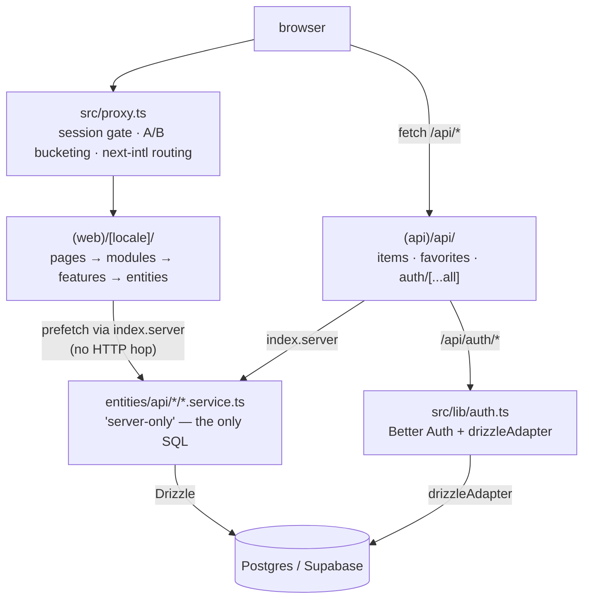

# Codebase Wiki — f1-catalog

A **Next.js 16 App Router** application: a catalog of F1 drivers with locale-aware search, favorites
and authentication. Client and server live in **one** deployment — the "backend" is the `(api)`
route group plus `'server-only'` services. Code under `src/` follows Feature-Sliced Design.

| Concern | Choice |
|---|---|
| Framework | Next.js 16.2.9 (App Router, `cacheComponents: true`) · React 19 |
| Data | Drizzle ORM over Postgres (hosted on Supabase; `supabase-js` unused for data access) |
| Server state | TanStack Query v5 |
| Auth | Better Auth (email+password, optional GitHub/Google) |
| i18n | next-intl 4.13 — `en` (default, unprefixed) + `uk` |
| Experiments | GrowthBook · analytics: Mixpanel |
| UI | Tailwind + shadcn components under `shared/components/ui` · next-themes |
| Tests | Playwright e2e (18 tests, separate test DB) |

## Architecture at a glance

The two arrows into `SVC` are the point: a server render and a client fetch call the **same** query
function, so they cannot disagree. Detail in [[data-flow]].

## Pages

- [[architecture]] — the single-deployment shape: `(web)` vs `(api)`, the two-barrel runtime split
  inside an entity api slice, what `cacheComponents: true` forces, the provider stack, the edge gate.
- [[data-flow]] — the two read paths (server prefetch vs client fetch), the route-handler contract,
  locale-aware column picking, `db.$count` aggregates, and the two write mechanisms (optimistic
  TanStack mutation vs server action with cache tags).
- [[auth]] — Better Auth server instance and client adapter, self-disabling OAuth providers,
  server-side session reads, and all page gating in `src/proxy.ts`.
- [[database-and-migrations]] — the Drizzle client (`prepare: false` for the pooler), the schema's two
  table groups, the generate/migrate/push workflow, why `drizzle.config.ts` may read `process.env`,
  and seeding.
- [[testing]] — Playwright layout, the three isolation mechanisms (test DB guard, `.next-e2e` build
  dir, port 3100), how a run proceeds, and the recorded flaky-test baseline.

## What this wiki deliberately does not cover

**Structural rules.** Where a file goes, what may import what, barrel discipline, naming suffixes,
the `(api)` handler contract as *law*, and the data-layer/auth/TanStack conventions are owned by
`.claude/skills/client-structure/` — the skill is the single source of truth and ships executable
checkers (`scripts/check-layer-imports.mjs`, `scripts/check-barrels.mjs`). There are no
`client-shared` / `client-pkg` / `modules-widgets` pages here on purpose: a second copy of those
rules would drift from the first.

Workflow procedures live in their own skills too: `/add-feature` (DB → API → UI ordering),
`/review-changes` (diff review), `/next-intl` (localization), `/git-workflow` (branches and commits).

---

*Maintained by the AI agent per the conventions in `AGENTS.md`. Pages cross-link with
`[[wikilinks]]`; every claim is grounded in the actual source. The append-only run history is in
`log.md`.*
